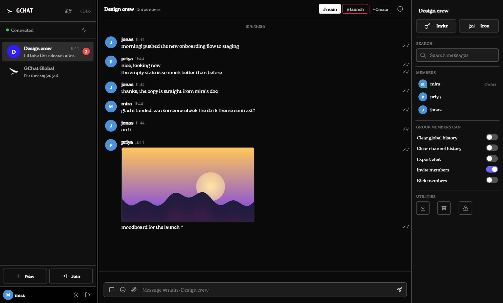
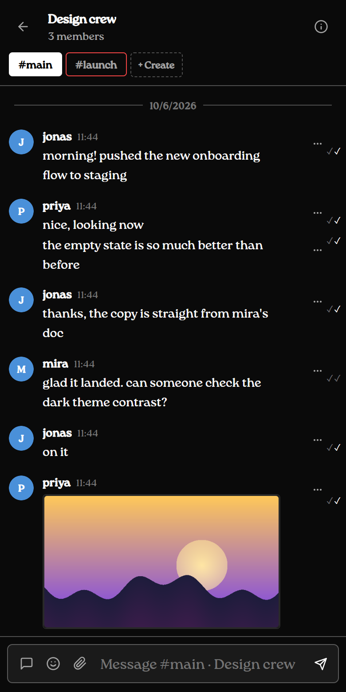

# GChat

Group chat where the server only ever stores ciphertext. Messages, images and files are encrypted in the client with a per-group key; the server keeps the encrypted blobs, the membership list and an escrowed copy of each group key so a new device can catch up. It runs on Node, Express, Socket.IO and SQLite, and is hosted on Railway.



There are three ways to use it, all talking to the same server:

| Client | What it is |
|---|---|
| **Web / PWA** | The main app, served from `public/`. Installs to a phone home screen. |
| **Desktop** | A thin native window around the hosted app, with a tray icon and notifications. Windows uses WebView2, macOS uses Tauri. See [INSTALL_DESKTOP.md](INSTALL_DESKTOP.md). |
| **CLI** | `gchat` in a terminal: an animated home screen, then a full chat UI in the style of Claude Code, with mouse support and inline image previews. See [cli/README.md](cli/README.md). |

<p>
  
  
</p>

## What you get

- Groups you join with a six-character invite code, each with named channels (`#main` plus whatever you add)
- Text, images, files, whispers, replies, edits and disappearing messages
- Read receipts, typing indicators, presence and per-channel unread counts
- Profile colors and pictures, group admin roles and member permissions
- Web push notifications, with generic text only (the server can't read messages)
- An optional Ask-AI assistant, off unless `AI_ENABLED=1` (see [docs/operations.md](docs/operations.md))

## Run it locally

You need Node 18 or newer.

```bash
npm ci --include=dev
npm run dev:web
```

Open <http://localhost:4400> and sign in as `root` / `root`. Local debug mode seeds that account and a playground group, and keeps the database in `.gchat-local/`. `dev:web` also rebuilds `public/app.js` and `public/style.css` from `src/` when you save.

To run the server without the debug fixtures, set the three secrets from the table below and run `node server.js`.

### Checks

```bash
npm run verify      # lint, bundle the web app, run the server tests
npm run test:cli    # CLI unit + integration tests
npm run test:e2e    # Playwright, against a local server
npm run test:desktop  # cargo tests for both desktop shells
```

Load tests and anything that hammers the API must target a local or disposable server, never the Railway deployment. [AGENTS.md](AGENTS.md) has the rest of the rules for changing request rates, queries or socket fan-out.

## Configuration

| Variable | Required | Notes |
|---|---|---|
| `SESSION_SECRET` | yes | Signs session cookies. Long and random. |
| `GROUP_KEY_ESCROW_MASTER_KEY` | yes | 32 bytes, base64url. Encrypts group keys at rest. Keep it in deployment secrets only. |
| `GROUP_CODE_PEPPER` | yes | 32+ characters. Used to HMAC invite codes. |
| `DB_PATH` | yes in production | SQLite file, e.g. `/data/gchat.db` on a Railway volume. |
| `PORT` | no | Railway sets it. |
| `BUCKET_*`, `GCHAT_MEDIA_DIRECT` | for media | Railway bucket for encrypted attachments. See the ops guide before turning it on. |
| `VAPID_*` | for push | `npx web-push generate-vapid-keys`. |
| `ADMIN_SECRET` | no | Enables `GET /api/admin/users`. |
| `AI_ENABLED`, `OPENCODE_ZEN_API_KEY`, `LANGSEARCH_API_KEY` | no | Ask-AI assistant and its free web search. See the ops guide. |
| `LOGTO_*` | no | Email verification through Logto. |

Hard limits in production: 100 groups per user, 250 members per group, 100 messages per page, eight concurrent push deliveries. Nothing polls; chat data is loaded when you open a group.

## How the encryption works

1. A new group gets a random 256-bit secret, generated in the client.
2. HKDF derives separate keys for content, metadata, channel tags and spam signatures.
3. Messages are encrypted with AES-256-GCM, bound to the group, message id, sender, type and revision.
4. Channel names and reply previews live in the encrypted metadata. The server only sees a keyed blind index per channel.
5. When someone joins with a valid code, the server hands them the group secret over TLS from the escrow record.

This is not end-to-end encryption against whoever runs the server: the operator can recover group keys from escrow. The server also sees usernames, membership, timestamps, who sent what, and whether two messages in a group are identical. Clients keep a decrypted copy of history in IndexedDB (or `vault.json` for the CLI) on the device.

## Repository layout

```
server.js            entry point, loads src/server/runtime.js
src/server/          routes, sockets, sync protocol, migrations
src/web/, src/styles/  source for the web app (bundled into public/)
public/              served files; app.js and style.css are build output
cli/                 the gchat terminal client (own package.json)
src-desktop-win/     Windows shell (Rust, wry/WebView2)
src-tauri/           macOS shell (Tauri 2)
electron/            experimental Electron shell
scripts/             build, migration and maintenance scripts
test/                server tests; test/e2e for Playwright
docs/                operations guide and screenshots
```

Edit the files in `src/`, not the bundles in `public/`.

## More

- [docs/operations.md](docs/operations.md): deploying to Railway, migrations, PWA and push setup, scaling limits
- [changelog.md](changelog.md)
