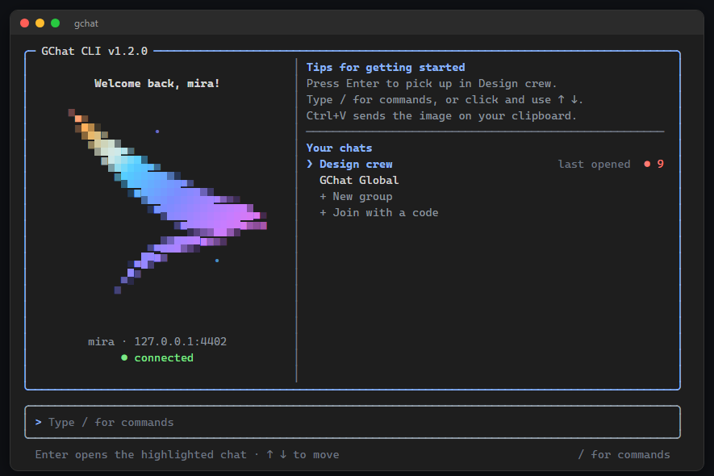
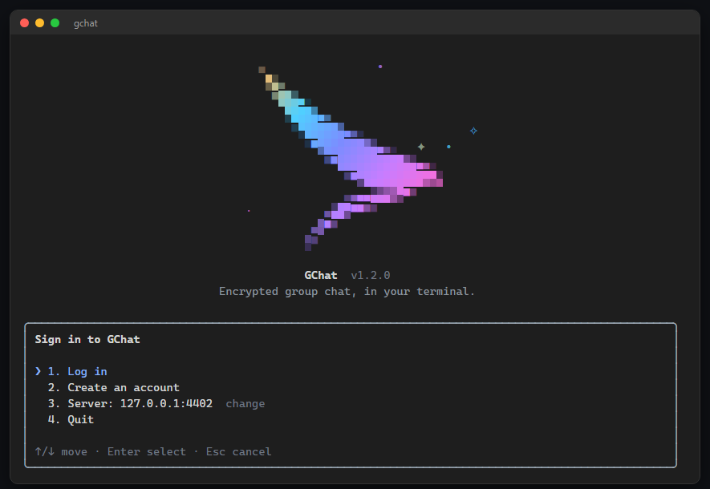
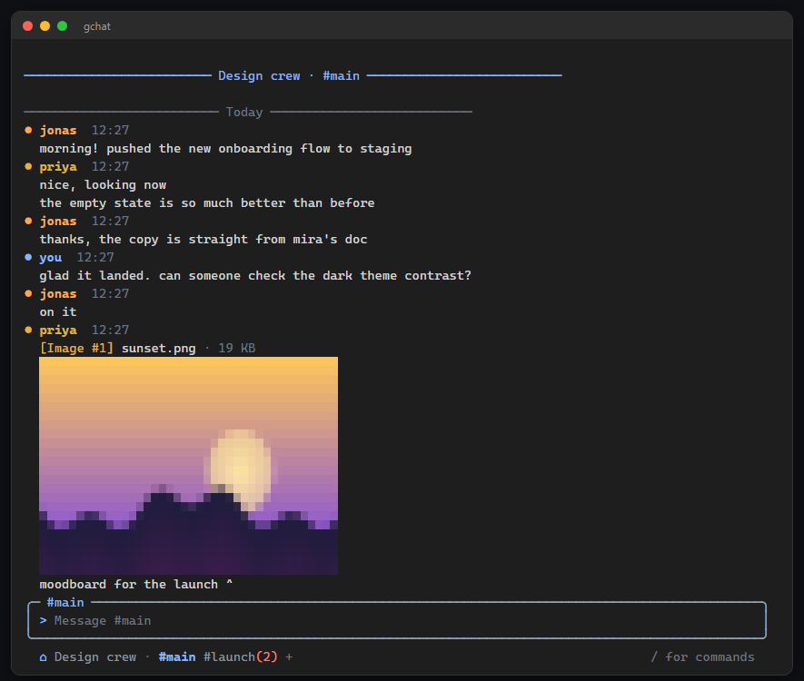
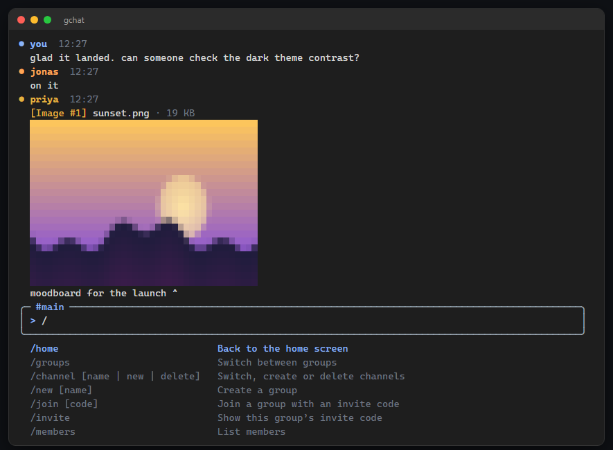

# gchat

GChat in your terminal. Type `gchat` and you land on a home screen with your chats; pick one and you're in. It runs inside your normal terminal like Claude Code does (no full-screen takeover), so messages scroll into your real scrollback and copy works. Signing in, switching chats and channels, replying, editing, sending and viewing images all happen in there.



It speaks the same protocol as the web and desktop apps (sync v2, AES-256-GCM, HKDF-SHA-256, group key recovery included), so the same account works everywhere.

## Install

You need Node 18 or newer.

```bash
cd cli
npm install
npm link        # puts `gchat` on your PATH
gchat
```

Without linking, `node cli/bin/gchat.js` does the same. Standalone binaries for macOS, Windows and Linux are attached to GitHub releases tagged `cli-v*`.

The first run points at `https://gchat.up.railway.app`. To use another server:

```bash
gchat --server http://127.0.0.1:4400        # this run only
gchat config set server http://127.0.0.1:4400   # remember it
```

## Using it

Run `gchat`. If you're not signed in you get a small menu (log in, create an account, change server, quit) under the bird.



After that you're on the home screen. Your last chat is highlighted, so Enter picks up where you left off; use the arrow keys or click to choose another, or create or join a group from the list. Click the bird if you like. Opening a chat prints the recent messages with a "new messages" line above anything you haven't read. Type to chat, press Enter to send, `/home` (or the ⌂ in the footer) to go back.



Type `/` to open the command menu, narrow it by typing, and use the arrow keys, Tab and Enter.



| Key | Does |
|---|---|
| Enter | Send |
| Alt+Enter, Ctrl+J, or `\` then Enter | New line |
| Tab / Shift+Tab (empty input) | Next / previous channel |
| Ctrl+G | Switch group |
| Mouse click | Footer: ⌂ home, group name, channel names, `+` new channel, other-group dots. Also home-screen chats, menu rows and command-menu rows |
| Ctrl+V, Alt+V | Attach the image on your clipboard |
| Up / Down | Earlier messages you typed |
| Esc | Cancel a reply, edit or attachment, or close the menu |
| Ctrl+C | Clear the input; press twice on an empty input to quit |
| Ctrl+D | Quit (empty input) |
| Ctrl+L | Clear the screen |

Pasting a file path, or dragging a file into the terminal, attaches it. Press Enter to send it.

### Commands

| Command | Does |
|---|---|
| `/home` (`/h`) | Back to the home screen |
| `/groups` (`/g`) | Pick a group, or create or join one |
| `/channel [name]` | Switch channel; `new <name>` and `delete <name>` also work |
| `/new [name]`, `/join [code]`, `/invite` | Create a group, join with a code, show the invite code |
| `/members` | List members |
| `/reply`, `/edit`, `/delete` | Pick one of the recent messages and act on it |
| `/upload <path>`, `/paste` | Send a file or image, or the clipboard image |
| `/view [n]` | Show image number *n* at full size (latest image if you leave it out) |
| `/save [n] [path]`, `/launch [n]` | Save an attachment, or open it in your default app |
| `/history`, `/search <text>` | Load earlier messages; search what's loaded |
| `/whisper <user> <text>` | Private message |
| `/mouse [on|off]` | Turn click support on or off |
| `/theme dark|light`, `/clear`, `/status`, `/whoami`, `/logout`, `/help`, `/quit` | Housekeeping |

Anything else you can run as `gchat <command>` also works after a slash, for example `/members kick <user>` or `/groups settings`. Destructive ones ask for confirmation first.

### Mouse

Clicks work on the footer (channel names, the group name, the ⌂, the `+` for a new channel, dots for other groups with unread messages), on chats on the home screen, and on rows in menus. While mouse support is on, the terminal passes clicks to gchat instead of selecting text, so hold Shift (Option in some macOS terminals) to select, and use your terminal's scrollbar or Shift+PageUp to scroll back. `/mouse off` hands both back for good; `gchat config set mouse off` makes it the default.

### Images

Images show up as small previews right in the chat, each labelled `[Image #n]`. `/view n` draws one larger. PNG and JPEG are decoded in the terminal using half-block characters, which works everywhere. In iTerm2 and WezTerm the real image is shown instead. GIF and WebP can't be previewed; use `/launch n` to open them. Set `gchat config set preview off` to turn previews off.

### Unread

Opening a channel marks it read on the server, so the dots on the web and desktop apps clear too. If your terminal reports focus (most do), messages that arrive while you're in another window stay unread until you come back. The footer shows unread counts for other channels, and for other groups with a dot.

## One-shot commands

Everything is also available without the UI, which is handy for scripts:

```bash
gchat login -u alice
gchat groups
gchat open "Design crew"
gchat send "build is green"
gchat upload ./screenshot.png
gchat history --limit 20 --json
```

Global flags: `--server <url>`, `--json`, `--yes`, `-h`, `-V`. Run `gchat help` for the full list.

`gchat --classic` starts the older full-screen UI.

## Where things are stored

`~/.config/gchat` on Linux and macOS, `%APPDATA%\gchat` on Windows, or the folder in `GCHAT_CONFIG_DIR`.

| File | Contents |
|---|---|
| `config.json` | server, theme, bell, preview, mouse |
| `session.json` | session cookie and CSRF token |
| `vault.json` | group encryption keys (mode 0600) |
| `prefs.json` | last group and channel, muted groups |

`vault export` writes every group key in the clear, so treat the file like a password dump. Decrypted attachments for `/launch` live in the OS temp folder and are deleted when you quit.

## Development

```bash
cd cli
npm test               # unit and integration tests
npm run test:unit      # skips the in-process server tests
```

The integration tests start their own local server and never touch the hosted one. The UI lives in `src/ui/` (renderer, key and mouse parser, editor, home screen and bird, image decoding, app); the shared client is in `src/client/`.

### Speed

Starting needs one round trip (session check and chat list together) and opening a chat needs one more (history and unread counts together; the socket and member list fill in behind it). CSRF tokens are cached, requests have timeouts, and WebSocket is tried before long polling. Images that are about to be shown are decoded while the text above them prints.

## Releasing

Standalone binaries are built by `.github/workflows/build-cli.yml` when a tag like `cli-v1.2.0` is pushed (or from the Actions tab). The workflow runs the unit tests, compiles with Bun for macOS (arm64 and x64), Windows and Linux, and attaches the files to a GitHub release. It deliberately does not mark that release as "latest", because the desktop updater reads `releases/latest`. The npm name `gchat-cli` belongs to someone else, so publishing to npm would need a scoped name first.
