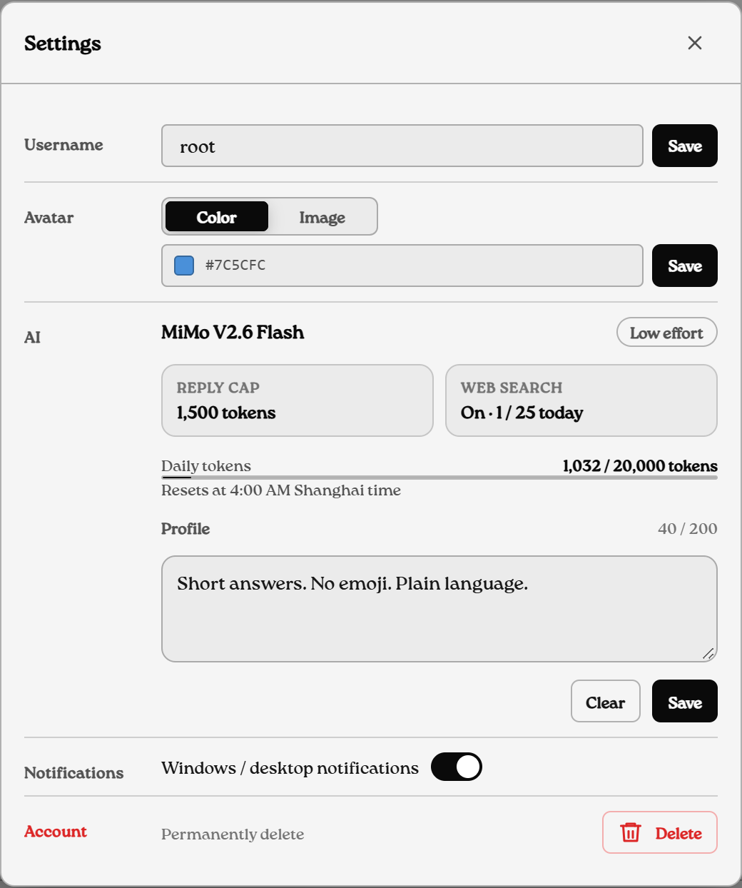

# Operations

Notes for whoever deploys and looks after the hosted server. Everything here assumes a single Node instance with SQLite on a Railway volume.

## First deploy

1. Create a Railway project from the repository (`railway.json` already points at `node server.js` and the `/api/health` check).
2. Add a volume mounted at `/data`.
3. Set `SESSION_SECRET`, `GROUP_CODE_PEPPER`, `GROUP_KEY_ESCROW_MASTER_KEY` and `DB_PATH=/data/gchat.db`. Leave `AI_ENABLED` unset unless you mean to run the assistant.
4. Deploy, then check sign-up, joining with an invite code, sending a message and uploading a file.

Without a volume the database disappears on every redeploy. Normal startup never resets data or runs a destructive migration. Keep backups.

If users reach the app from mainland China, pick a region near them (Singapore works), keep both Socket.IO transports enabled, and consider a custom domain if `*.railway.app` is flaky.

## Migrations

**Sync v2 (v1.4.5).** The server refuses to start without the new schema. Rehearse on a backup first, then apply during a maintenance window:

```bash
DB_PATH=/path/to/backup.db npm run migrate:sync-v2 -- --dry-run
DB_PATH=/path/to/backup.db npm run migrate:sync-v2 -- --verify
DB_PATH=/data/gchat.db npm run migrate:sync-v2 -- --apply
DB_PATH=/data/gchat.db npm run migrate:sync-v2 -- --verify
```

It checks message counts and sampled ciphertext hashes, has an eight-minute budget, and never decrypts or re-encrypts anything.

**`#main` tag index (next release).** `#main` messages are stored with a NULL `tag_index` because read cursors match on `tag_index IS NULL`. The CLI used to stamp `#main` with a real blind index, which left those messages unread for everyone forever. The CLI is fixed, and on the first boot after upgrading the server runs a one-time pass (one `UPDATE` per escrowed group, flagged in `_config` as `main_tag_index_nulled_v2`) that clears the index on rows already written. It does not touch ciphertext.

**Groups created before key escrow.** Their keys only existed in browsers, so they can't be recovered. To remove them, stop the app, take a verified backup and run:

```powershell
$env:DB_PATH = '/data/gchat.db'
$env:BACKUP_CONFIRMED = '1'
$env:CONFIRM_LEGACY_GROUP_PURGE = 'DELETE_PRE_ESCROW_GROUPS'
npm run purge:pre-escrow-groups
```

It deletes only groups without a complete escrow record, plus their messages, memberships and read state. Invite codes created before escrow can be migrated with `npm run migrate:group-invite-codes` (production also needs `GCHAT_GROUP_CODE_MIGRATION_APPROVED=1`).

## Attachments

Encrypted attachments can go to a private Railway bucket instead of SQLite. Create the bucket, allow `PUT`, `GET` and `HEAD` from the exact app origin, allow the `Content-Type`, `x-amz-meta-sha256` and `x-amz-checksum-sha256` headers, expose `ETag`, and set the `BUCKET_*` variables. Only set `GCHAT_MEDIA_DIRECT=1` once the database has been stable for a day.

The server accepts uploads up to 15 MB. JSON request bodies are capped at 256 KB, so clients must send attachments as raw `application/octet-stream` (the web app and CLI do).

## Installing the PWA

Android (Chrome): open the site, then menu → **Install app** or **Add to Home screen**.

iPhone and iPad (Safari): **Share** → **Add to Home Screen**, then launch it from the icon. iOS only allows push notifications for the home-screen app.

For notifications, open the installed app, sign in with **Remember me** on, then Profile → **Enable notifications**. Push payloads that arrive while the app is closed carry only the sender and group name, never message text. Badges, sounds and Do Not Disturb behavior depend on the OS and browser.

To turn push on for a deployment:

```bash
npx web-push generate-vapid-keys
```

and set `VAPID_PUBLIC_KEY`, `VAPID_PRIVATE_KEY` and `VAPID_SUBJECT` (`mailto:you@example.com`).

Web updates deploy through Railway; installed apps pick them up on the next refresh and show an offline page when there's no connection.

## Admin endpoint

With `ADMIN_SECRET` set:

```bash
curl https://<host>/api/admin/users -H "Authorization: Bearer <ADMIN_SECRET>"
```

returns `id`, `username`, `iconColor` and `createdAt` for every account. No password hashes.

## Ask-AI assistant

Off unless `AI_ENABLED=1`. A message sent in AI mode goes to one model, MiMo V2.6 Flash, through the OpenCode Go subscription (`OPENCODE_ZEN_API_KEY`). Reasoning is fixed to low (thinking off; MiMo has no effort levels) and replies are capped at 1,500 tokens (`AI_MAX_OUTPUT_TOKENS`, 256 to 4,000).



**Web search.** Set `LANGSEARCH_API_KEY` (free, no card) and the model can search the web when a question needs fresh facts. `TAVILY_API_KEY` (free plan) is an optional backup. Searches run on the server, are cached for ten minutes, and are limited to 25 per user and 120 overall per day (`AI_SEARCH_USER_DAILY_LIMIT`, `AI_SEARCH_GLOBAL_DAILY_LIMIT`). The search query is the only thing that leaves the encrypted chat. Without a key there is no search tool.

**Profile.** Each user can save up to 200 characters of custom instructions in Settings. They are added to the system prompt for that user's questions only.

**History tools.** Because messages are encrypted, the history tools run in the browser: the server relays the tool calls and the client answers from its decrypted cache. The assistant can only read the chat it was asked in, with at most four relayed tool rounds, 40 messages and 24 KB per history fetch.

**Quotas.** Daily tokens default to 20,000 per user and 200,000 overall, reset at 04:00 Shanghai time, and each group has its own `ai_enabled` switch. `OPENCODE_BASE_URL`, `LANGSEARCH_BASE_URL` and `TAVILY_BASE_URL` exist for local testing against a mock.

## Scaling limits

One Node process and one SQLite file. Going beyond that needs PostgreSQL, a Redis adapter for Socket.IO, a shared session store, sticky sessions or WebSocket-only transport, and object storage for every attachment.

## Before real users

- Secrets set and a volume mounted at `/data`
- Sign-up, invite joins, messaging and uploads checked end to end
- The desktop installer tried on a clean Windows machine
- Backups scheduled
